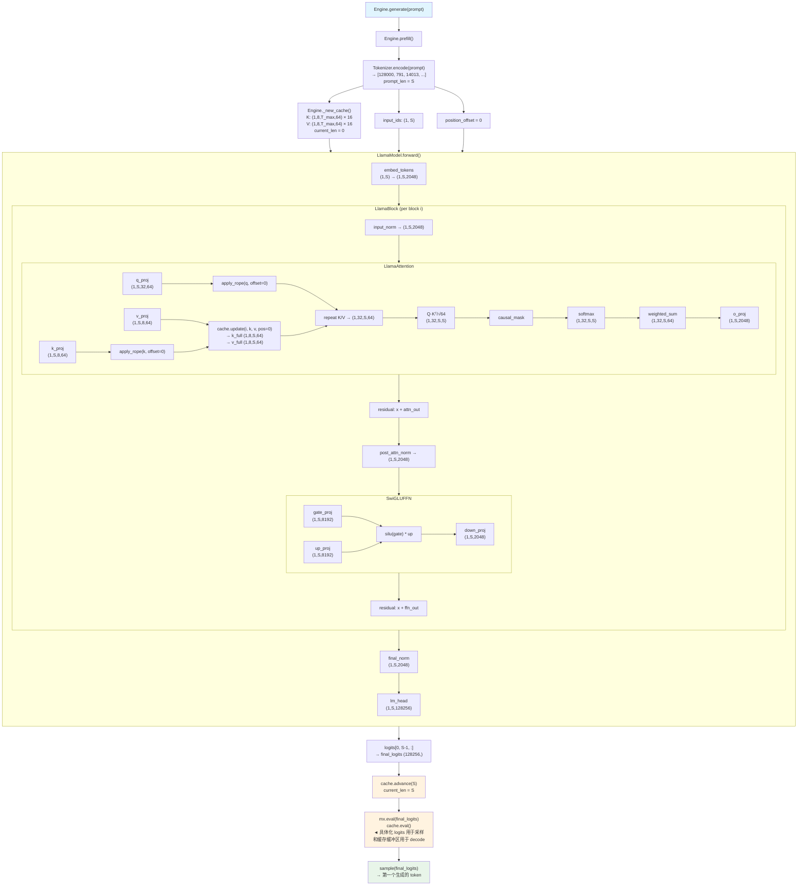
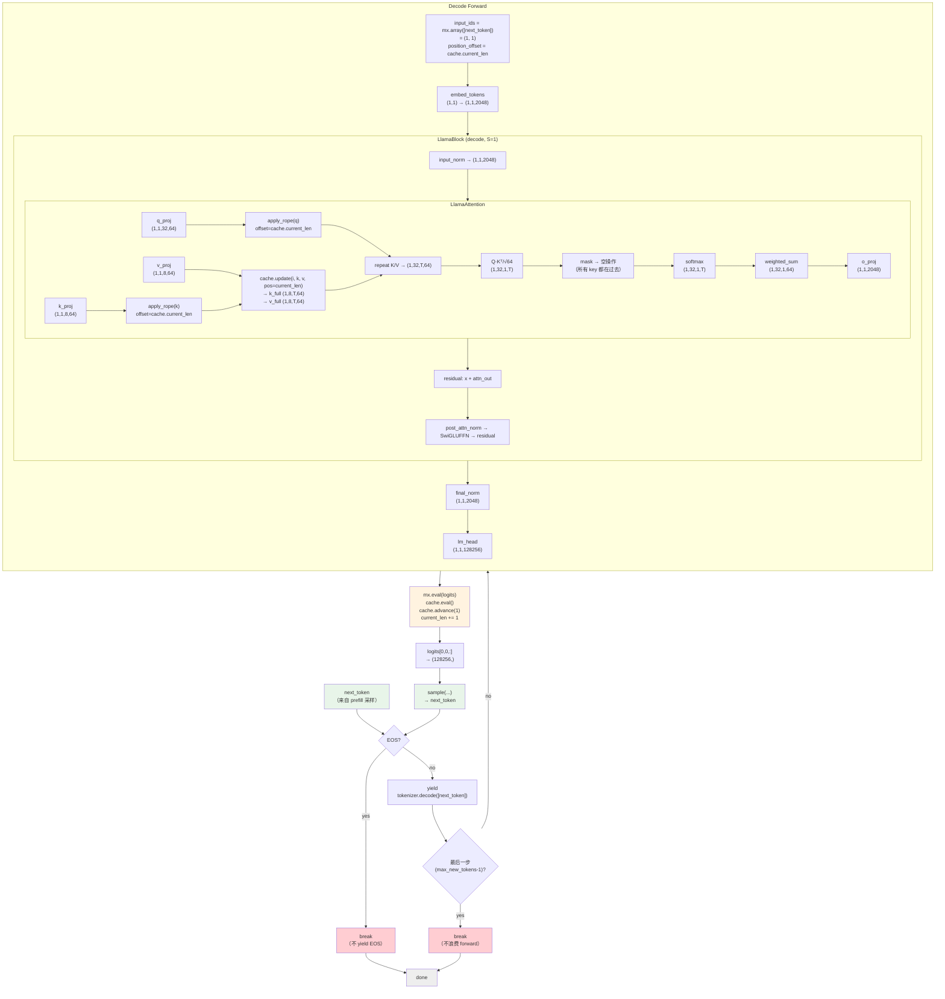
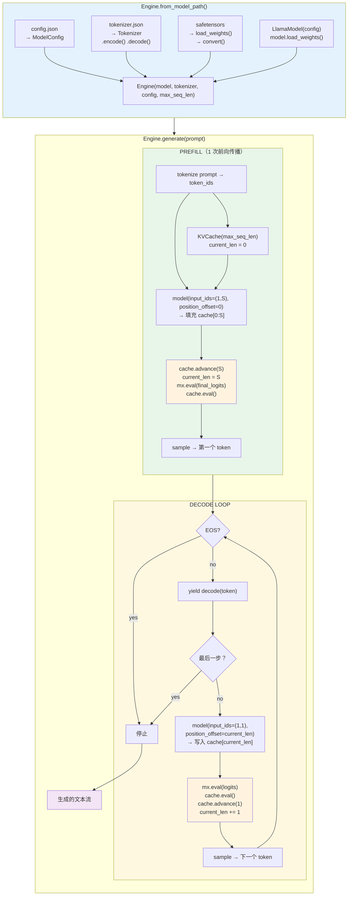

# 数据流图

展示一次生成请求中每个阶段的张量形状。配合 [内部原理](internals_zh.md) 和
[Phase 规范](../docs/phases/phase-1-mlx-single-user.md#tensor-shape-conventions) 一起阅读。

---

## Prefill（预填充）

```
                           ┌───────────────────────────────────────┐
                           │           Engine.generate()           │
                           └───────────────────┬───────────────────┘
                                               │
                                               ▼
                           ┌───────────────────────────────────────┐
                           │           Engine.prefill()            │
                           └───────────────────┬───────────────────┘
                                               │
                                     prompt: "The capital of..."
                                               │
                                               ▼
┌─────────────────┐              ┌──────────────────────────────────┐
│   tokenizer.json │────────────▶│   Tokenizer.encode(prompt)       │
│   tokenizer_config.json       │   → [128000, 791, 14013, ...]     │
└─────────────────┘              └───────────────────┬──────────────┘
                                                    │
                                          token_ids: list[int]
                                          prompt_len = S
                                                    │
                         ┌──────────────────────────┼──────────────────────────┐
                         │                          ▼                          │
                         │              ┌───────────────────────┐              │
                         │              │   Engine._new_cache() │              │
                         │              │   KVCache(n_layers,   │              │
                         │              │     n_kv_heads,       │              │
                         │              │     max_seq_len,      │              │
                         │              │     head_dim)         │              │
                         │              └───────────┬───────────┘              │
                         │                          │                          │
                         │              K: (1,8,T_max,64) × 16 *               │
                         │              V: (1,8,T_max,64) × 16 *               │
                         │              current_len = 0                        │
                         │                          │                          │
                         │              ┌───────────▼───────────┐              │
                         ▼              │                        │              ▼
               input_ids: (1,S)    cache (empty)        position_offset=0
                         │              │                        │
                         │    ┌─────────┴────────┐               │
                         │    │                  │               │
                         ▼    ▼                  ▼               ▼
               ┌─────────────────────────────────────────────────────┐
               │              LlamaModel.forward()                   │
               │                                                     │
               │  ┌──────────────────────────────────────────────┐  │
               │  │  embed_tokens(input_ids) → (1, S, 2048)      │  │
               │  └────────────────────┬─────────────────────────┘  │
               │                      │                              │
               │                      ▼                              │
               │  ┌──────────────────────────────────────────────┐  │
               │  │  LlamaBlock × 16                             │  │
               │  │                                              │  │
               │  │  For each block i:                           │  │
               │  │    1. input_norm(x)  → (1, S, 2048)         │  │
               │  │    2. attn(normed_x) → (1, S, 2048)         │  │
               │  │       ├─ q_proj → (1, S, 32, 64)            │  │
               │  │       ├─ k_proj → (1, S, 8, 64)             │  │
               │  │       ├─ v_proj → (1, S, 8, 64)             │  │
               │  │       ├─ apply_rope(q, offset=0)            │  │
               │  │       ├─ apply_rope(k, offset=0)            │  │
               │  │       ├─ cache.update(i, k, v, pos=0)       │  │
               │  │       │    → k_full (1,8,S,64)              │  │
               │  │       │    → v_full (1,8,S,64)              │  │
               │  │       ├─ repeat K/V → (1,32,S,64)           │  │
               │  │       ├─ Q·K^T/√64 → (1,32,S,S)            │  │
               │  │       ├─ causal_mask → (1,32,S,S)           │  │
               │  │       ├─ softmax → (1,32,S,S)               │  │
               │  │       ├─ weighted_sum → (1,32,S,64)         │  │
               │  │       └─ o_proj → (1, S, 2048)              │  │
               │  │    3. residual: x = x + attn_out             │  │
               │  │    4. post_attn_norm(x) → (1, S, 2048)      │  │
               │  │    5. ffn(normed_x) → (1, S, 2048)          │  │
               │  │       ├─ gate_proj → (1, S, 8192)           │  │
               │  │       ├─ up_proj   → (1, S, 8192)           │  │
               │  │       ├─ silu(gate) * up → (1, S, 8192)    │  │
               │  │       └─ down_proj → (1, S, 2048)           │  │
               │  │    6. residual: x = x + ffn_out              │  │
               │  └────────────────────┬─────────────────────────┘  │
               │                      │                              │
               │                      ▼                              │
               │  ┌──────────────────────────────────────────────┐  │
               │  │  final_norm(x) → (1, S, 2048)               │  │
               │  └────────────────────┬─────────────────────────┘  │
               │                      │                              │
               │                      ▼                              │
               │  ┌──────────────────────────────────────────────┐  │
               │  │  lm_head(x) → (1, S, 128256)                │  │
               │  └────────────────────┬─────────────────────────┘  │
               └───────────────────────┼────────────────────────────┘
                                       │
                             logits: (1, S, 128256)
                                       │
                         ┌─────────────▼─────────────┐
                         │  logits[0, S-1, :]        │
                         │  → final_logits (128256,) │
                         └─────────────┬─────────────┘
                                       │
                         ┌─────────────▼─────────────┐
                         │  cache.advance(S)         │  ◄── 提交全部 16 层的写入
                         │  current_len = S          │
                         └─────────────┬─────────────┘
                                       │
                         ┌─────────────▼─────────────┐
                         │  mx.eval(final_logits)    │  ◄── 为 CPU 采样具体化
                         │  cache.eval()             │      为 decode 读取具体化
                         └─────────────┬─────────────┘
                                       │
                         ┌─────────────▼─────────────┐
                         │  sample(final_logits)     │
                         │  → token "Paris" (3663)   │
                         └─────────────┬─────────────┘
                                       │
                              ┌────────┴────────┐
                              │  进入 decode 循环  │
                              └───────────────────┘
```

### Mermaid — Prefill



---

## Decode Loop（解码循环）

```
┌─────────────────────────────────────────────────────────────────────┐
│                    Engine.generate()  decode loop                    │
│                                                                     │
│  current_len = S (来自 prefill)                                      │
│  next_token  = 第一个采样的 token（来自 prefill logits）              │
│                                                                     │
│  ┌───────────────────────────────────────────────────────────────┐  │
│  │  for step in range(max_new_tokens):                           │  │
│  │                                                               │  │
│  │    ┌─ EOS? ──────────────────────────────────────────────┐   │  │
│  │    │   yes → break（不 yield EOS token）                  │   │  │
│  │    └──────────────────────────────────────────────────────┘   │  │
│  │                                                               │  │
│  │    ┌─ yield tokenizer.decode([next_token]) ─────────────┐     │  │
│  │    │   例如 " Paris", ",", " located", " in", " the"    │     │  │
│  │    └──────────────────────────────────────────────────────┘   │  │
│  │                                                               │  │
│  │    ┌─ 最后一步？ ────────────────────────────────────────┐     │  │
│  │    │   yes → break（不浪费最后一次 forward）              │     │  │
│  │    └──────────────────────────────────────────────────────┘   │  │
│  │                                                               │  │
│  │    ┌─────────────────────────────────────────────────────┐    │  │
│  │    │                DECODE FORWARD                       │    │  │
│  │    │                                                     │    │  │
│  │    │  input_ids = mx.array([[next_token]])               │    │  │
│  │    │            = (1, 1)                                 │    │  │
│  │    │  position_offset = cache.current_len                │    │  │
│  │    │                                                     │    │  │
│  │    │  ┌─────────────────────────────────────────────┐   │    │  │
│  │    │  │  embed_tokens(input_ids) → (1, 1, 2048)    │   │    │  │
│  │    │  └──────────────────┬──────────────────────────┘   │    │  │
│  │    │                     │                              │    │  │
│  │    │                     ▼                              │    │  │
│  │    │  ┌─────────────────────────────────────────────┐   │    │  │
│  │    │  │  LlamaBlock × 16 (decode 模式, S=1)        │   │    │  │
│  │    │  │                                             │   │    │  │
│  │    │  │  For each block i:                          │   │    │  │
│  │    │  │    input_norm(x) → (1, 1, 2048)            │   │    │  │
│  │    │  │                                             │   │    │  │
│  │    │  │    LlamaAttention (decode):                 │   │    │  │
│  │    │  │      q_proj → (1, 1, 32, 64)               │   │    │  │
│  │    │  │      k_proj → (1, 1, 8, 64)                │   │    │  │
│  │    │  │      v_proj → (1, 1, 8, 64)                │   │    │  │
│  │    │  │      apply_rope(q, offset=cache.current_len)│   │    │  │
│  │    │  │      apply_rope(k, offset=cache.current_len)│   │    │  │
│  │    │  │      cache.update(i, k, v, pos=current_len) │   │    │  │
│  │    │  │        → k_full (1, 8, T, 64)   T=S+step   │   │    │  │
│  │    │  │        → v_full (1, 8, T, 64)             │   │    │  │
│  │    │  │      repeat K/V → (1, 32, T, 64)           │   │    │  │
│  │    │  │      Q·K^T/√64 → (1, 32, 1, T)            │   │    │  │
│  │    │  │      mask → 空操作（所有 key 都在过去）     │   │    │  │
│  │    │  │      softmax → (1, 32, 1, T)               │   │    │  │
│  │    │  │      weighted_sum → (1, 32, 1, 64)         │   │    │  │
│  │    │  │      o_proj → (1, 1, 2048)                 │   │    │  │
│  │    │  │                                             │   │    │  │
│  │    │  │    residual: x + attn_out                    │   │    │  │
│  │    │  │    post_attn_norm → SwiGLUFFN → residual    │   │    │  │
│  │    │  └──────────────────┬──────────────────────────┘   │    │  │
│  │    │                     │                              │    │  │
│  │    │                     ▼                              │    │  │
│  │    │    final_norm(x) → (1, 1, 2048)                   │    │  │
│  │    │    lm_head(x)    → (1, 1, 128256)                 │    │  │
│  │    └─────────────────────┬──────────────────────────────┘    │  │
│  │                          │                                   │  │
│  │                          ▼                                   │  │
│  │    ┌─────────────────────────────────────────────────────┐   │  │
│  │    │  mx.eval(logits)                                    │   │  │
│  │    │  cache.eval()                                       │   │  │
│  │    │  cache.advance(1)          current_len += 1         │   │  │
│  │    └───────────────────────────┬─────────────────────────┘   │  │
│  │                                │                             │  │
│  │    ┌───────────────────────────▼─────────────────────────┐   │  │
│  │    │  logits[0, 0, :] → (128256,)                       │   │  │
│  │    │  sample(...) → next_token                          │   │  │
│  │    └─────────────────────────────────────────────────────┘   │  │
│  │                                                               │  │
│  │    ◄──────── 用新的 next_token 回到循环开头 ─────────────────┘  │
│  └──────────────────────────────────────────────────────────────────┘
└─────────────────────────────────────────────────────────────────────┘
```

### Mermaid — Decode Loop



---

## 完整流程 —— 端到端

```
┌──────────┐    ┌───────────┐    ┌──────────────┐    ┌──────────────────┐
│  config   │    │ tokenizer │    │  safetensors  │    │    用户 prompt    │
│  .json    │    │  .json    │    │  (HF 权重)    │    │                  │
└─────┬─────┘    └─────┬─────┘    └───────┬──────┘    └────────┬─────────┘
      │                │                  │                     │
      ▼                ▼                  ▼                     │
┌───────────┐   ┌───────────┐   ┌───────────────┐               │
│ModelConfig│   │ Tokenizer │   │ load_weights() │               │
│           │   │ .encode() │   │ convert()      │               │
│           │   │ .decode() │   │ load_weights() │               │
└─────┬─────┘   └─────┬─────┘   └───────┬───────┘               │
      │               │                 │                        │
      │    ┌──────────┴─────────┐       │                        │
      │    │                    │       │                        │
      ▼    ▼                    ▼       ▼                        ▼
┌─────────────────────────────────────────────────────────────────────┐
│                         Engine.from_model_path()                    │
│                                                                     │
│   config = load_config(model_path)                                  │
│   tokenizer = Tokenizer.from_pretrained(model_path)                 │
│   hf_weights = load_weights(model_path)                             │
│   project_weights = convert(hf_weights, config)                     │
│   model = LlamaModel(config)                                        │
│   model.load_weights(project_weights)                               │
│                                                                     │
│   → Engine(model, tokenizer, config, max_seq_len)                   │
└──────────────────────────────────┬──────────────────────────────────┘
                                   │
                                   ▼
┌─────────────────────────────────────────────────────────────────────┐
│                      Engine.generate(prompt)                        │
│                                                                     │
│  ┌──────── PREFILL ────────┐                                        │
│  │ tokenize → forward(S,0) │                                        │
│  │ → 填充 cache[0:S]       │                                        │
│  │ → eval logits + cache   │                                        │
│  │ → 采样第 1 个 token      │                                        │
│  └──────────┬──────────────┘                                        │
│             │                                                       │
│             ▼                                                       │
│  ┌──────── DECODE LOOP ────────────────────────────────────────┐    │
│  │                                                             │    │
│  │  对每个 token:                                               │    │
│  │    yield decode(token_text)                                 │    │
│  │    forward(next_token, current_len)                         │    │
│  │    → 写入 cache[current_len]                                │    │
│  │    → eval logits + cache                                    │    │
│  │    → advance(1)                                             │    │
│  │    → 采样下一个 token                                        │    │
│  │                                                             │    │
│  │  停止: EOS 或 max_new_tokens                                │    │
│  └─────────────────────────────────────────────────────────────┘    │
└─────────────────────────────────────────────────────────────────────┘
                                   │
                                   ▼
                         生成的文本流
```

### Mermaid — 完整流程



---

## 关键形状速查

| 符号 | 含义 | Llama-3.2-1B |
|--------|---------|--------------|
| `B` | batch 大小 | 1 |
| `S` | 序列长度（prefill: prompt_len; decode: 1） | 可变 |
| `T` | KV 缓存总长度（每步增长） | 可变 |
| `D` | 隐藏维度 | 2048 |
| `H` | 查询头数 | 32 |
| `Hkv` | 键/值头数（GQA） | 8 |
| `Dh` | 头维度 | 64 |
| `V` | 词表大小 | 128256 |
| `L` | Transformer 层数 | 16 |
| `I` | FFN 中间维度 | 8192 |
| `n_groups` | GQA 分组数（H / Hkv） | 4 |

## KV 缓存内存

```
每层、每个缓冲区:  (1, Hkv, T, Dh) × dtype_bytes
总计:              2 × L × Hkv × T × Dh × 2 字节 (bfloat16)

T=1024:  2 × 16 × 8 × 1024 × 64 × 2 = 33,554,432 字节 ≈ 32 MB
T=2048:  2 × 16 × 8 × 2048 × 64 × 2 = 67,108,864 字节 ≈ 64 MB
```
