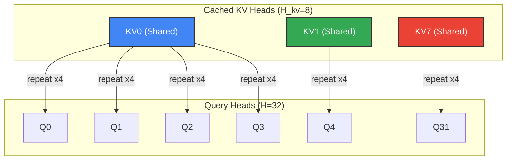
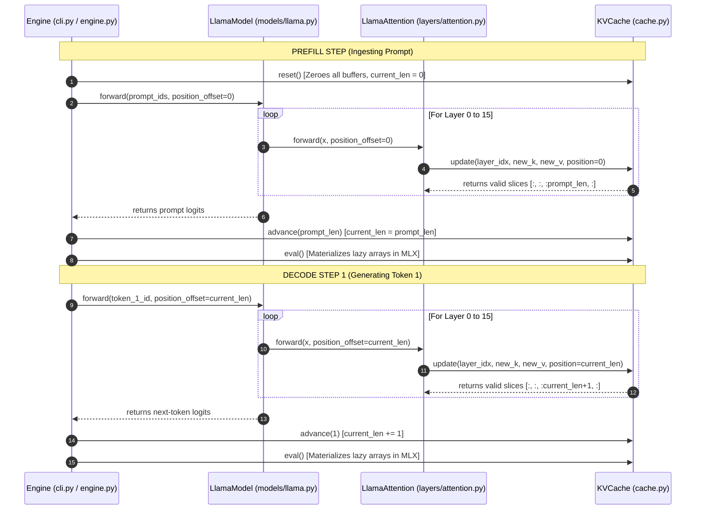

# Deep Dive: GQA and KV Cache Geometries

This document provides a visual, mathematical, and structural walkthrough of the twin engines of `tiny-duo-infer`'s data plane: **Grouped Query Attention (GQA)** and the **KV Cache**. 

Understanding how these two subsystems manage tensor shapes, transpositions, and positional alignments is the key to understanding how a modern high-performance inference engine (like vLLM) functions.

---

## 1. The Core Mathematics of GQA

In standard Multi-Head Attention (MHA), every query head has its own dedicated key and value head. While mathematically expressive, this causes the size of the KV cache to grow rapidly, creating a severe memory-bandwidth bottleneck during generation.

Grouped Query Attention (GQA) addresses this by partitioning $H$ query heads into $H_{\text{kv}}$ key-value groups. For a group $g$, the attention equation is:

$$\text{Attention}(Q_g, K_g, V_g) = \text{softmax}\left( \frac{Q_g (K_g^{\text{expanded}})^T}{\sqrt{D_h}} + M \right) V_g^{\text{expanded}}$$

Where:
* $D_h$: Head dimension ($D_h = D / H$).
* $K_g^{\text{expanded}}, V_g^{\text{expanded}}$: The shared key and value head repeated $n_{\text{groups}}$ times to align with the query head count.
* $M$: The causal attention mask blocking attention to future tokens.

### Hyperparameters in `Llama-3.2-1B`

| Symbol | Hyperparameter | Value | Description |
| :--- | :--- | :--- | :--- |
| $D$ | `d_model` | $2048$ | The base hidden state size. |
| $H$ | `n_heads` | $32$ | Number of query attention heads. |
| $H_{\text{kv}}$ | `n_kv_heads` | $8$ | Number of key/value heads. |
| $D_h$ | `head_dim` | $64$ | Dimensionality of each head ($2048 / 32$). |
| $n_{\text{groups}}$ | `n_groups` | $4$ | The query-to-KV ratio ($H / H_{\text{kv}} = 32 / 8$). |

---

## 2. GQA Tensor Geometry & Shape Flow

At forward-pass time, hidden state tensors must be sliced, projected, transposed, and repeated. The table below traces these shape transformations through `LlamaAttention.forward`:

| Step | Operation | Source Line | Shape |
| :--- | :--- | :--- | :--- |
| **0** | Input hidden states ($x$) | `x` | $(B, S, D)$ |
| **1** | Project queries, keys, and values | `self.q_proj(x)` | $(B, S, H, D_h)$<br>$(B, S, H_{\text{kv}}, D_h)$<br>$(B, S, H_{\text{kv}}, D_h)$ |
| **2** | Apply RoPE rotary positional offsets | `apply_rope(q, ...)` | $(B, S, H, D_h)$<br>$(B, S, H_{\text{kv}}, D_h)$ |
| **3** | Transpose K & V for storage | `mx.transpose(k, (0, 2, 1, 3))` | $(B, H_{\text{kv}}, S, D_h)$ |
| **4** | Commit to & read valid KV Cache slice | `cache.update(...)` | $(B, H_{\text{kv}}, T, D_h)$ |
| **5** | Transpose Q for dot product | `mx.transpose(q, (0, 2, 1, 3))` | $(B, H, S, D_h)$ |
| **6** | **GQA Expansion (Repeat KV heads)** | `mx.repeat(..., repeats=4, axis=1)` | $(B, H, T, D_h)$ |
| **7** | Compute raw attention scores | `q_t @ k_expanded.T` | $(B, H, S, T)$ |
| **8** | Apply Causal Mask & Softmax | `_apply_causal_mask(...)` | $(B, H, S, T)$ |
| **9** | Weighted sum with value activations | `weights @ v_expanded` | $(B, H, S, D_h)$ |
| **10** | Merge heads & run Output projection | `reshape(...)` + `self.o_proj(...)` | $(B, S, D)$ |

### Visualizing the GQA Head Expansion

During step **6**, `mx.repeat(..., axis=1)` takes the $8$ KV heads and replicates each head $4$ times to form $32$ matching heads. 

This ensures that query heads $[0, 1, 2, 3]$ all map to KV head $0$, query heads $[4, 5, 6, 7]$ map to KV head $1$, and so on:



> [!IMPORTANT]  
> The head repetition **must** occur along `axis=1` (the head axis). Repeating along `axis=2` would repeat sequence positions instead, leading to a severe silent logical bug.

---

## 3. Causal Attention Masking (Prefill vs. Decode)

The causal attention mask $M$ enforces that a query token at position $i$ cannot attend to a key token at position $j$ if $j > i$.

In the code, this is calculated as:
$$\text{Mask}_{i, j} = \begin{cases} 0 & \text{if } j \le i \\ -10^9 & \text{if } j > i \end{cases}$$

Before softmax, adding $-10^9$ to future positions reduces their exponentiated weights to $0$, cleanly cutting off the information flow.

```python
# From tiny_duo_infer/layers/attention.py
query_positions = position_offset + mx.arange(S)  # (S,)
key_positions = mx.arange(T)                      # (T,)
future_mask = key_positions[None, :] > query_positions[:, None]  # Broadcasts to (S, T)
```

### Shape and Mask Differences: Prefill vs. Decode

#### Case A: Prefill Step ($S = \text{prompt\_len}$, $T = \text{prompt\_len}$)
The system ingests the prompt all at once. Because we are feeding a full matrix of queries, we must apply a causal triangular mask:

$$\text{future\_mask} = \begin{pmatrix} 
0 & 1 & 1 \\ 
0 & 0 & 1 \\ 
0 & 0 & 0 
\end{pmatrix}$$

```text
Query 0 (Pos 0) -> [Key 0 (valid), Key 1 (masked), Key 2 (masked)]
Query 1 (Pos 1) -> [Key 0 (valid), Key 1 (valid),  Key 2 (masked)]
Query 2 (Pos 2) -> [Key 0 (valid), Key 1 (valid),  Key 2 (valid)]
```

#### Case B: Decode Step ($S = 1$, $T = \text{prompt\_len} + \text{steps}$)
During generation, the query is just a **single token** ($S = 1$). Its absolute position is `position_offset` (e.g., $3$). It attends to all past keys ($T = [0, 1, 2, 3]$).

Since `key_positions` ($[0, 1, 2, 3]$) are all $\le$ `query_positions` ($[3]$), `future_mask` is completely zeroed out:

$$\text{future\_mask} = \begin{pmatrix} 0 & 0 & 0 & 0 \end{pmatrix}$$

> [!TIP]  
> In many model implementations, masking is completely bypassed when $S=1$ to save clock cycles. Our implementation uses a single, mathematically unified `_apply_causal_mask` function that automatically handles this by inspecting tensor shapes, making the codebase highly educational.

---

## 4. KV Cache Lifecycle: The Prefill-Decode Protocol

In a single-user engine, `KVCache` acts as a request-scoped stateful buffer. It pre-allocates contiguous memory for the maximum possible context length `max_seq_len` to avoid memory fragmentation.

To maintain perfect synchronization across all 16 layers of the transformer, `KVCache` decouples its operations into a **Write Phase** and a **Commit Phase**:



### Trace of Cache Slots and Indices

Let's look at what happens under the hood in the `_keys` and `_values` buffers (shape `(1, Hkv, max_seq_len, Dh)`) for a sequence with `max_seq_len = 6`:

#### 1. Initial State (`current_len = 0`)
```text
[ . ][ . ][ . ][ . ][ . ][ . ]
```

#### 2. After Prefill (`prompt_len = 3`)
* `LlamaAttention` calls `update(position=0, new_len=3)`
* Slices `[0:3]` are populated with prompt keys and values.
* Cache slice `[:3]` is returned.
* `Engine` calls `advance(3)` $\rightarrow$ `current_len = 3`
```text
[ K ][ K ][ K ][ . ][ . ][ . ]
  0    1    2
```

#### 3. Decode Step 1
* `LlamaAttention` calls `update(position=3, new_len=1)`
* Slot `[3]` is populated with the new token's key/value.
* Cache slice `[:4]` is returned.
* `Engine` calls `advance(1)` $\rightarrow$ `current_len = 4`
```text
[ K ][ K ][ K ][ K ][ . ][ . ]
  0    1    2    3
```

> [!WARNING]  
> If an agent attempts to read `cache.current_len` inside `LlamaAttention.forward` to determine the write target, it creates race conditions. Because all layers execute in a single forward pass, modifying `current_len` mid-run would mean Layer 15 sees a different index than Layer 0. **Decoupled passing of `position_offset` resolves this entirely.**

---

## 5. Bridging the Gap to Production: How vLLM Does It

While `tiny-duo-infer`'s static pre-allocated buffer is perfect for learning the geometry of KV cache interactions, it differs significantly from production engines like **vLLM**.

### The Problem with Static Contiguous Caches
1. **Internal Fragmentation:** If `max_seq_len` is set to $8192$ but the request terminates after $100$ tokens, the remaining $8092$ allocated slots sit unused, wasting valuable GPU VRAM.
2. **No Multi-User Sharing:** Contiguous allocations cannot easily share prefixes (such as system prompts or few-shot exemplars) without physically copying tensors.

### The vLLM Solution: PagedAttention
vLLM solves this by borrowing the concept of **Virtual Memory Paging** from Operating Systems:

```text
Logical KV Cache (Tokens 0..31)
[ Block 0 (Tokens 0..15) ] ---> Maps to ---> Physical Page 104 (VRAM)
[ Block 1 (Tokens 16..31) ] --> Maps to ---> Physical Page 42  (VRAM)
```

1. **Logical vs. Physical:** Instead of pre-allocating a contiguous buffer, the KV cache is divided into logical "pages" (e.g., blocks of 16 tokens).
2. **Page Table Allocation:** A global `BlockManager` manages a pool of free physical memory blocks on the GPU. When a request needs to store more tokens, vLLM grabs any free block and registers it in the request's logical-to-physical block table.
3. **Scatter-Gather Kernels:** At attention computation time, custom CUDA kernels gather the non-contiguous physical pages dynamically from VRAM based on the block table, performing GQA directly on fragmented memory blocks.

*(In Phase 3 of `tiny-duo-infer`, we will implement this exact PagedAttention block manager and FIFO scheduler!)*
