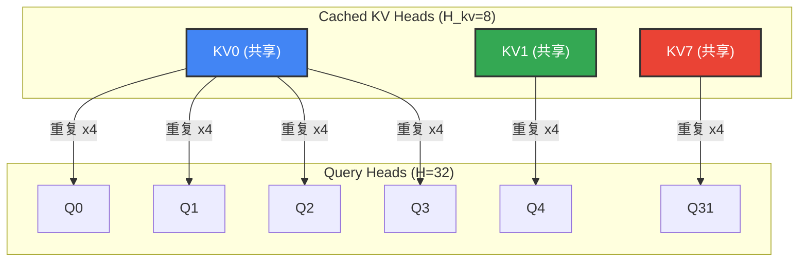
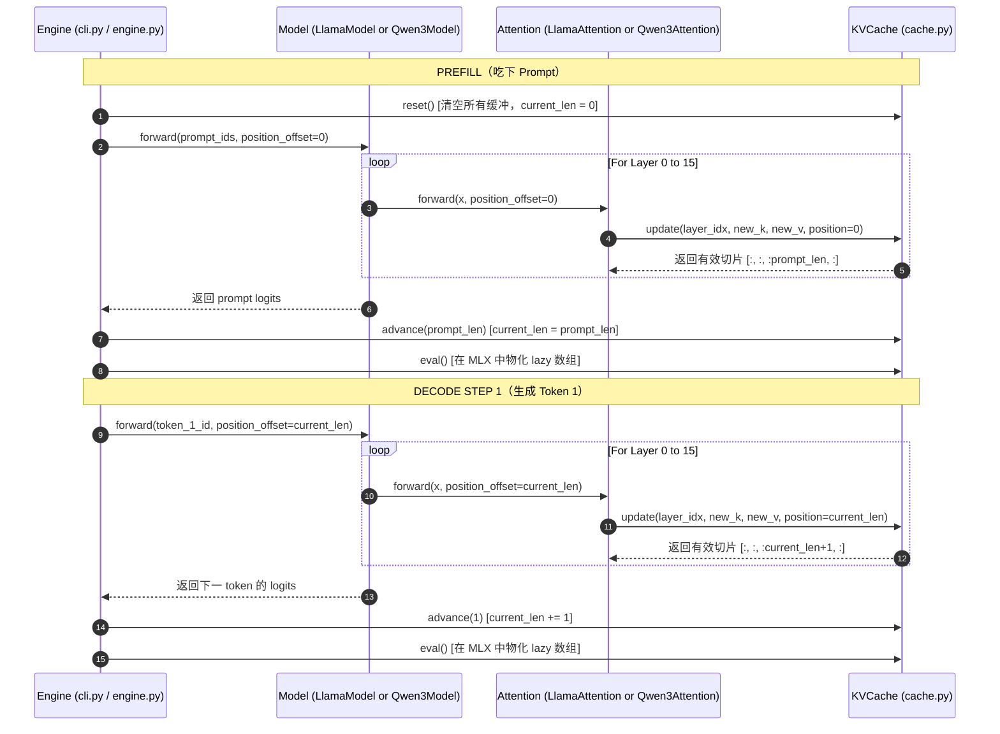

# 深入解析：GQA 与 KV Cache 几何

本文以可视化、数学化和结构化的角度，完整解读 `tiny-duo-infer` 数据面的两台引擎：**分组查询注意力（Grouped Query Attention, GQA）** 与 **KV Cache**。

理解这两个子系统如何处理张量形状、转置以及位置对齐，是理解一台现代高性能推理引擎（例如 vLLM）的关键。

---

## 1. GQA 的核心数学

在标准多头注意力（Multi-Head Attention, MHA）中，每个 query head 都有自己专属的 key/value head。这虽然在数学上表达力很强，但会导致 KV cache 体积迅速膨胀，在生成阶段制造严重的内存带宽瓶颈。

分组查询注意力（GQA）通过把 $H$ 个 query head 划分为 $H_{\text{kv}}$ 个 key-value 组来解决这个问题。对组 $g$，注意力公式为：

$$\text{Attention}(Q_g, K_g, V_g) = \text{softmax}\left( \frac{Q_g (K_g^{\text{expanded}})^T}{\sqrt{D_h}} + M \right) V_g^{\text{expanded}}$$

其中：
* $D_h$：head 维度。Llama 中为 $D / H$；Qwen3 中从 `config.json` 显式读取。
* $K_g^{\text{expanded}}, V_g^{\text{expanded}}$：共享的 key/value head 沿 head 轴重复 $n_{\text{groups}}$ 次以与 query head 数量对齐。
* $M$：因果注意力掩码，用来屏蔽对未来 token 的注意力。

### `Llama-3.2-1B` 的超参

| 符号 | 超参 | 数值 | 含义 |
| :--- | :--- | :--- | :--- |
| $D$ | `d_model` | $2048$ | 隐状态基础维度 |
| $H$ | `n_heads` | $32$ | query 头数 |
| $H_{\text{kv}}$ | `n_kv_heads` | $8$ | key/value 头数 |
| $D_h$ | `head_dim` | $64$ | 每个 head 的维度（$2048 / 32$） |
| $n_{\text{groups}}$ | `n_groups` | $4$ | query 与 KV 的比值（$H / H_{\text{kv}} = 32 / 8$） |

### `Qwen3-0.6B` 的超参

Qwen3 仍然采用 GQA 思想，但打破了 Llama 中一个隐含假设：**注意力宽度未必等于隐状态维度。**

| 符号 | 超参 | 数值 | 含义 |
| :--- | :--- | :--- | :--- |
| $D$ | `d_model` | $1024$ | 残差流的隐状态宽度 |
| $H$ | `n_heads` | $16$ | query 头数 |
| $H_{\text{kv}}$ | `n_kv_heads` | $8$ | key/value 头数 |
| $D_h$ | `head_dim` | $128$ | config 中显式指定的 per-head 维度 |
| $A$ | `n_heads * head_dim` | $2048$ | 注意力投影宽度，**不等于** $D$ |
| $n_{\text{groups}}$ | `n_groups` | $2$ | query 与 KV 的比值（$H / H_{\text{kv}} = 16 / 8$） |

这就是 Phase 1.5 想传授的核心**模型族 portability 课题**。KV cache 仍然存 `(B, Hkv, T, Dh)`，`n_groups` 仍然按 `H // Hkv` 推导。变化的只是注意力周围的投影：

```text
q_proj: D -> A
k_proj: D -> Hkv * Dh
v_proj: D -> Hkv * Dh
o_proj: A -> D
```

---

## 2. GQA 张量几何与形状流

前向传播时，隐状态张量需要被切分、投影、转置、重复。下表追踪了 `LlamaAttention.forward` 中的每一步形状变换：

| 步骤 | 操作 | 源代码 | 形状 |
| :--- | :--- | :--- | :--- |
| **0** | 输入隐状态 ($x$) | `x` | $(B, S, D)$ |
| **1** | 投影 Q/K/V | `self.q_proj(x)` | $(B, S, H, D_h)$<br>$(B, S, H_{\text{kv}}, D_h)$<br>$(B, S, H_{\text{kv}}, D_h)$ |
| **2** | 应用 RoPE 旋转位置偏移 | `apply_rope(q, ...)` | $(B, S, H, D_h)$<br>$(B, S, H_{\text{kv}}, D_h)$ |
| **3** | 把 K/V 转置以便存储 | `mx.transpose(k, (0, 2, 1, 3))` | $(B, H_{\text{kv}}, S, D_h)$ |
| **4** | 提交并读出有效的 KV cache 切片 | `cache.update(...)` | $(B, H_{\text{kv}}, T, D_h)$ |
| **5** | 把 Q 转置以便点积 | `mx.transpose(q, (0, 2, 1, 3))` | $(B, H, S, D_h)$ |
| **6** | **GQA 扩展（重复 KV head）** | `mx.repeat(..., repeats=4, axis=1)` | $(B, H, T, D_h)$ |
| **7** | 计算原始注意力分数 | `q_t @ k_expanded.T` | $(B, H, S, T)$ |
| **8** | 应用因果掩码并 softmax | `_apply_causal_mask(...)` | $(B, H, S, T)$ |
| **9** | 用 value 张量做加权求和 | `weights @ v_expanded` | $(B, H, S, D_h)$ |
| **10** | 合并 head 并跑输出投影 | `reshape(...)` + `self.o_proj(...)` | $(B, S, D)$ |

`Qwen3Attention.forward` 复用同一套 GQA/cache 几何，但在 RoPE 之前多了两个细节：

| 步骤 | 操作 | 形状 |
| :--- | :--- | :--- |
| **1a** | `q_proj(x)` | $(B, S, A)$，其中 $A = H \cdot D_h$ |
| **1b** | reshape Q | $(B, S, H, D_h)$ |
| **1c** | reshape K/V | $(B, S, H_{\text{kv}}, D_h)$ |
| **2a** | `q_norm(q)`, `k_norm(k)` | 形状不变；一份 `(Dh,)` 权重在所有 head 间共享 |
| **2b** | 对归一化后的 Q/K 应用 RoPE | 形状不变 |
| **10** | 合并 head，再 `o_proj` | $(B, S, A) \rightarrow (B, S, D)$ |

顺序很关键：

```text
project -> reshape into heads -> q_norm/k_norm -> RoPE -> cache/update -> GQA
```

如果把 Q/K norm 放到 RoPE 之后，进入注意力点积的向量就和 Qwen3 训练时使用的不一致了——这是模型架构层面的 bug，不是简单的重构。

### GQA Head 扩展可视化

第 **6** 步中 `mx.repeat(..., axis=1)` 把 8 个 KV head 各自复制 4 份，得到 32 个 head 与 query 一一对应。

也就是说：query head $[0, 1, 2, 3]$ 共享 KV head 0，query head $[4, 5, 6, 7]$ 共享 KV head 1，依此类推：



> [!IMPORTANT]
> head 的复制**必须**沿 `axis=1`（head 轴）进行。沿 `axis=2` 重复会改成重复序列位置，造成严重的"静默逻辑 bug"。

Qwen3-0.6B 的 group 数更少：`H=16`、`Hkv=8`，每个 KV head 只重复两次，而不是四次。实现不应硬编码 Llama 的 group 数。

---

## 3. 因果注意力掩码（Prefill vs. Decode）

因果掩码 $M$ 强制约束：query token 在位置 $i$ 不能注意到 key 在位置 $j$（若 $j > i$）。

代码中按下式构造：
$$\text{Mask}_{i, j} = \begin{cases} 0 & \text{if } j \le i \\ -10^9 & \text{if } j > i \end{cases}$$

在 softmax 之前给未来位置加上 $-10^9$，能把这些位置的指数权重推到 $0$，干净地切断信息流。

```python
# 摘自 tiny_duo_infer/layers/attention.py
query_positions = position_offset + mx.arange(S)  # (S,)
key_positions = mx.arange(T)                      # (T,)
future_mask = key_positions[None, :] > query_positions[:, None]  # 广播为 (S, T)
```

### 形状与掩码差异：Prefill vs. Decode

#### 情况 A：Prefill 阶段（$S = \text{prompt\_len}$，$T = \text{prompt\_len}$）
系统一次性吃下整段 prompt。我们送入的是一整个 query 矩阵，因此必须施加一个下三角因果掩码：

$$\text{future\_mask} = \begin{pmatrix} 
0 & 1 & 1 \\ 
0 & 0 & 1 \\ 
0 & 0 & 0 
\end{pmatrix}$$

```text
Query 0 (Pos 0) -> [Key 0 (有效), Key 1 (掩盖), Key 2 (掩盖)]
Query 1 (Pos 1) -> [Key 0 (有效), Key 1 (有效),  Key 2 (掩盖)]
Query 2 (Pos 2) -> [Key 0 (有效), Key 1 (有效),  Key 2 (有效)]
```

#### 情况 B：Decode 阶段（$S = 1$，$T = \text{prompt\_len} + \text{steps}$）
生成阶段 query 只是**一个 token**（$S = 1$）。它的绝对位置是 `position_offset`（例如 $3$）。它要注意全部历史 key（$T = [0, 1, 2, 3]$）。

因为 `key_positions`（$[0, 1, 2, 3]$）都 $\le$ `query_positions`（$[3]$），`future_mask` 整体为 0：

$$\text{future\_mask} = \begin{pmatrix} 0 & 0 & 0 & 0 \end{pmatrix}$$

> [!TIP]
> 许多模型实现会在 $S=1$ 时直接跳过掩码以省点周期。我们的实现使用一个数学上统一的 `_apply_causal_mask` 函数，由它检查张量形状自动处理这种退化情况——这让代码本身更具教育意义。

---

## 4. KV Cache 生命周期：Prefill-Decode 协议

在单用户引擎里，`KVCache` 充当 request 作用域的有状态缓冲区。它一次性预分配 `max_seq_len` 长度的连续内存，避免运行时碎片。

为了让所有 transformer 层之间保持完美同步，`KVCache` 把操作解耦成 **写入阶段（Write Phase）** 与 **提交阶段（Commit Phase）**：

```text
Llama-3.2-1B:  L=16, Hkv=8, Dh=64
Qwen3-0.6B:    L=28, Hkv=8, Dh=128
```

Phase 1.5 对 Qwen3 完全沿用相同的 cache 协议——只是维度改变。引擎仍然按 prompt 或生成 token 步**调用一次** `cache.advance()`；attention 层永远不持有 `current_len`。



### Cache 槽位与索引追踪

让我们看看 `_keys` 与 `_values` 缓冲区（形状 `(1, Hkv, max_seq_len, Dh)`）在 `max_seq_len = 6` 时的内部状态：

#### 1. 初始状态（`current_len = 0`）
```text
[ . ][ . ][ . ][ . ][ . ][ . ]
```

#### 2. Prefill 之后（`prompt_len = 3`）
* attention 调用 `update(position=0, new_len=3)`
* 索引 `[0:3]` 被填入 prompt 的 keys 和 values
* 返回 cache 切片 `[:3]`
* `Engine` 调用 `advance(3)` $\rightarrow$ `current_len = 3`
```text
[ K ][ K ][ K ][ . ][ . ][ . ]
  0    1    2
```

#### 3. Decode Step 1
* attention 调用 `update(position=3, new_len=1)`
* 槽位 `[3]` 被填入新 token 的 key/value
* 返回 cache 切片 `[:4]`
* `Engine` 调用 `advance(1)` $\rightarrow$ `current_len = 4`
```text
[ K ][ K ][ K ][ K ][ . ][ . ]
  0    1    2    3
```

> [!WARNING]
> 如果有人在 attention 层里读 `cache.current_len` 来决定写入位置，会产生竞态条件：所有层在一次前向中执行，前面的层修改 `current_len` 会让后面的层看到不同的索引。**把 `position_offset` 解耦传入完全规避了这个问题。**

---

## 5. 与生产引擎的差距：vLLM 是怎么做的

`tiny-duo-infer` 的静态预分配缓冲区非常适合学习 KV cache 的几何关系，但它和 **vLLM** 这类生产引擎差别极大。

### 静态连续 cache 的问题
1. **内部碎片：** 如果 `max_seq_len` 设为 $8192$ 但请求只生成 $100$ tokens 就结束，剩下 $8092$ 个槽位是浪费的 GPU VRAM。
2. **多用户无法共享：** 连续分配无法低成本地共享前缀（例如 system prompt、few-shot 例子），除非物理拷贝张量。

### vLLM 的解法：PagedAttention
vLLM 借用了操作系统的**虚拟内存分页**思想：

```text
逻辑 KV Cache (Tokens 0..31)
[ Block 0 (Tokens 0..15) ] ---> 映射到 ---> Physical Page 104 (VRAM)
[ Block 1 (Tokens 16..31) ] --> 映射到 ---> Physical Page 42  (VRAM)
```

1. **逻辑 vs 物理：** KV cache 不再连续预分配，而是被切成逻辑"页"（例如每页 16 tokens）。
2. **页表分配：** 一个全局 `BlockManager` 维护 GPU 上的物理空闲页池。当某请求需要更多 token 空间时，vLLM 抓任意一页空闲块并登记到该请求的 logical-to-physical 块表。
3. **Scatter-Gather Kernel：** 注意力计算时，定制 CUDA kernel 根据块表动态从 VRAM 中收集非连续的物理页，直接在碎片化内存上执行 GQA。

*（在 `tiny-duo-infer` 的 Phase 3，我们将自己实现这套 PagedAttention 块管理器与 FIFO 调度器！）*
