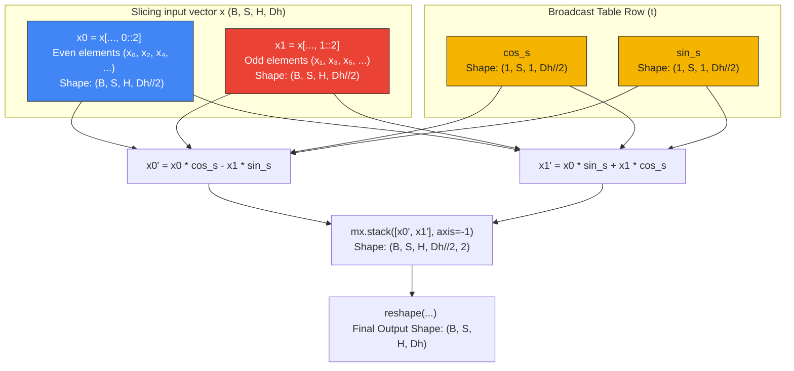

# Deep Dive: Rotary Positional Embeddings (RoPE)

This document provides a visual, mathematical, and structural walkthrough of **Rotary Positional Embeddings (RoPE)** in `tiny-duo-infer`. 

RoPE is one of the most elegant mathematical innovations in modern LLMs. It allows models to seamlessly extrapolate context lengths by encoding relative position directly into the attention mechanism.

---

## 1. Why Rotate? The Intuition

In standard attention, we compute the dot product between queries ($q$) and keys ($k$) to find their relevance scores:
$$\text{Attention Score}(q_m, k_n) = \langle q_m, k_n \rangle$$

Where:
* $q_m$ is the query vector at absolute position $m$.
* $k_n$ is the key vector at absolute position $n$.

Traditional positional encodings (like absolute sinusoidal shifts or learned embeddings) simply *add* positional information to the word representation:
$$\tilde{q}_m = q_m + p_m, \quad \tilde{k}_n = k_n + p_n$$

However, this additive approach does not naturally guarantee that the dot product $\langle \tilde{q}_m, \tilde{k}_n \rangle$ only depends on their **relative distance** $(m - n)$.

### The RoPE Breakthrough
RoPE replaces addition with **multiplication in the form of a rotation**. Instead of shifting vectors, it rotates them in 2D space. 

By applying a rotation operator $R$ to each vector:
$$\langle R_m q, R_n k \rangle = q^T R_m^T R_n k = q^T R_{m-n} k$$

Because of trigonometric identities, rotating both vectors by their respective absolute positions causes the dot product to preserve **only the relative difference $(m - n)$**. 

If $m = n$ (they are at the same position), the rotation cancels out entirely ($R_0 = I$). If $m$ and $n$ are far apart, they rotate away from each other, naturally decaying their attention score.

---

## 2. The Mathematics of RoPE

A head vector of dimension $D_h$ (e.g., $64$ in Llama-3.2-1B) is treated as a set of $D_h / 2$ ($32$) independent 2D planes. For each consecutive coordinate pair $(x_{2i}, x_{2i+1})$ at token position $t$:

$$\begin{pmatrix} x_{2i}' \\ x_{2i+1}' \end{pmatrix} = 
\begin{pmatrix} 
\cos(t \cdot \theta_i) & -\sin(t \cdot \theta_i) \\ 
\sin(t \cdot \theta_i) & \cos(t \cdot \theta_i) 
\end{pmatrix}
\begin{pmatrix} x_{2i} \\ x_{2i+1} \end{pmatrix}$$

Expanding this matrix multiplication yields:
$$x_{2i}' = x_{2i} \cos(t \cdot \theta_i) - x_{2i+1} \sin(t \cdot \theta_i)$$
$$x_{2i+1}' = x_{2i} \sin(t \cdot \theta_i) + x_{2i+1} \cos(t \cdot \theta_i)$$

Where $\theta_i$ represents the base frequency of the $i$-th plane:
$$\theta_i = \theta^{-2i / D_h}, \quad \text{for } i \in \left[0, 1, ..., \frac{D_h}{2} - 1\right]$$

In `Llama-3.2-1B`, the base frequency parameter $\theta$ (`rope_theta`) is set to $500,000.0$.
* A larger $\theta$ means the angles rotate more slowly along the dimensions.
* This slower rotation prevents high frequencies from wrapping around quickly, enabling the model to keep tokens mathematically distinct across long context windows (up to $131,072$ tokens).

---

## 3. Precomputing Frequencies

To maximize inference speed, the frequencies $\cos(t \cdot \theta_i)$ and $\sin(t \cdot \theta_i)$ are precomputed once at model initialization for all positions up to `max_seq_len`.

```python
# From tiny_duo_infer/layers/rope.py
i = mx.arange(0, head_dim, 2, dtype=mx.float32)  # Pairs: [0, 2, ..., Dh-2]
freqs = 1.0 / (theta ** (i / head_dim))           # (Dh // 2,)
positions = mx.arange(max_seq_len, dtype=mx.float32)  # (max_seq_len,)
angles = positions[:, None] * freqs[None, :]          # (max_seq_len, Dh // 2)
```

The resulting `cos_table` and `sin_table` (shapes `(max_seq_len, Dh // 2)`) acts as a look-up coordinate grid:

```text
Table: Shape (max_seq_len, Dh // 2)

Token Position (t) --->
t=0:  [ cos(0)     cos(0)     ... cos(0)     ]
t=1:  [ cos(1*θ₀)  cos(1*θ₁)  ... cos(1*θ_N) ]
t=2:  [ cos(2*θ₀)  cos(2*θ₁)  ... cos(2*θ_N) ]
...
```

---

## 4. Tensor Pair Slicing & Broadcasting

At forward-pass time, queries ($q$) and keys ($k$) carry shapes of `(B, S, H, Dh)`. 

To apply the 2D rotations efficiently in vector space, we slice each head along its last dimension into even/odd coordinate halves and broadcast our precomputed lookup values:



### The Slicing Technique: `0::2` and `1::2`
Instead of splitting the vector down the middle into two contiguous blocks of size $D_h / 2$, RoPE splits the vector by **consecutive interleaving pairs**:
* `x[..., 0::2]` selects indices $0, 2, 4, 6, \dots$ (the $x_0$ of each pair).
* `x[..., 1::2]` selects indices $1, 3, 5, 7, \dots$ (the $x_1$ of each pair).

This allows us to perform the 2D rotation simultaneously on all 32 pairs with simple element-wise array operations.

### Rebuilding the Tensor: `stack` and `reshape`
Once the rotated pairs $x0'$ (`x0_rot`) and $x1'$ (`x1_rot`) are computed, we must interleave them back to their original consecutive indices:
```python
# From tiny_duo_infer/layers/rope.py
rotated = mx.stack([x0_rot, x1_rot], axis=-1).reshape(B, S, H, Dh)
```

1. **`mx.stack(..., axis=-1)`:** Combines two tensors of shape `(B, S, H, Dh//2)` along a new final dimension, resulting in a shape of `(B, S, H, Dh//2, 2)`.
2. **`reshape(B, S, H, Dh)`:** Flattens the final two dimensions back into a single vector, restoring our interleaved order: $[x_0', x_1', x_2', x_3', \dots, x_{D_h-1}']$.

---

## 5. The Critical `offset` parameter

During generation, the KV cache grows step-by-step. The prefill phase ingests the prompt all at once, while the decode phase processes one token at a time.

```text
Sequence positions:
Prefill:         [0][1][2]
Decode Step 1:            [3]
Decode Step 2:               [4]
```

* **During Prefill ($S = 3$):** `offset = 0`. We fetch rows `cos[0:3]` and `sin[0:3]`, applying positions $0, 1, 2$ to the prompt tokens.
* **During Decode Step 1 ($S = 1$):** `offset = 3`. We fetch row `cos[3:4]` and `sin[3:4]`, applying position $3$ to the generated token.
* **During Decode Step 2 ($S = 1$):** `offset = 4`. We fetch row `cos[4:5]` and `sin[4:5]`, applying position $4$ to the next generated token.

> [!WARNING]  
> If the `offset` parameter is omitted or hardcoded to `0`, every generated decode token will be encoded at position `0` instead of its true sequence index. This completely scrambles relative distances in the attention layer, causing the model to produce gibberish after the first token. Decoupling the `offset` via the engine's cache manager is what keeps the generation loop coherent.
