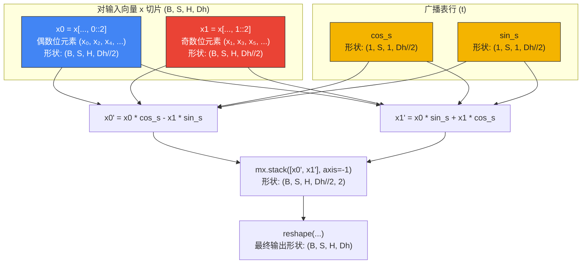

# 深入解析：旋转位置编码（RoPE）

本文以可视化、数学化和结构化的角度，完整解读 `tiny-duo-infer` 中的**旋转位置编码（Rotary Positional Embeddings, RoPE）**。

RoPE 是现代 LLM 中最优雅的一种数学创新。它将相对位置直接编码进注意力机制，让模型可以平滑地外推到更长的上下文。

---

## 1. 为什么是"旋转"？直觉解释

在标准注意力中，我们用 query（$q$）和 key（$k$）的内积计算相关性得分：
$$\text{Attention Score}(q_m, k_n) = \langle q_m, k_n \rangle$$

其中：
* $q_m$ 是绝对位置 $m$ 处的 query 向量。
* $k_n$ 是绝对位置 $n$ 处的 key 向量。

传统位置编码（绝对正弦位置移位、可学习位置嵌入等）只是简单地把位置信息**加到**词向量上：
$$\tilde{q}_m = q_m + p_m, \quad \tilde{k}_n = k_n + p_n$$

但这种"加法"做法并不能天然保证 $\langle \tilde{q}_m, \tilde{k}_n \rangle$ 仅依赖于二者的**相对距离 $(m - n)$**。

### RoPE 的突破
RoPE 把"加法"换成了"**以旋转为形式的乘法**"。它不平移向量，而是在 2D 平面里旋转向量。

对每个向量施加旋转算子 $R$：
$$\langle R_m q, R_n k \rangle = q^T R_m^T R_n k = q^T R_{m-n} k$$

由三角恒等式可知，给两个向量分别按各自的绝对位置旋转，内积结果**只保留相对差 $(m - n)$**。

如果 $m = n$（两 token 在同一位置），旋转完全相互抵消（$R_0 = I$）。如果 $m, n$ 距离很远，二者的旋转方向也会相互拉开，注意力得分自然衰减。

---

## 2. RoPE 的数学

一个维度为 $D_h$ 的 head 向量（例如 Llama-3.2-1B 中 $D_h = 64$）被视为 $D_h / 2 = 32$ 个相互独立的 2D 平面。对位置 $t$ 处的每一对相邻坐标 $(x_{2i}, x_{2i+1})$：

$$\begin{pmatrix} x_{2i}' \\ x_{2i+1}' \end{pmatrix} = 
\begin{pmatrix} 
\cos(t \cdot \theta_i) & -\sin(t \cdot \theta_i) \\ 
\sin(t \cdot \theta_i) & \cos(t \cdot \theta_i) 
\end{pmatrix}
\begin{pmatrix} x_{2i} \\ x_{2i+1} \end{pmatrix}$$

展开矩阵乘法得：
$$x_{2i}' = x_{2i} \cos(t \cdot \theta_i) - x_{2i+1} \sin(t \cdot \theta_i)$$
$$x_{2i+1}' = x_{2i} \sin(t \cdot \theta_i) + x_{2i+1} \cos(t \cdot \theta_i)$$

其中 $\theta_i$ 表示第 $i$ 个平面的基础频率：
$$\theta_i = \theta^{-2i / D_h}, \quad \text{for } i \in \left[0, 1, ..., \frac{D_h}{2} - 1\right]$$

在 `Llama-3.2-1B` 中，基础频率参数 $\theta$（`rope_theta`）取 $500{,}000.0$。
* $\theta$ 越大，沿维度方向的旋转角度变化越慢。
* 较慢的旋转能避免高频维度迅速绕回，让模型在长上下文窗口（最长 $131{,}072$ tokens）中保持各 token 在数学上可区分。

`Qwen3-0.6B` 的 `rope_theta` 更大（$1{,}000{,}000.0$），且 `head_dim` 是从 config 中显式读取的（`128`）。RoPE 的数学形式不变；只是因为每个 head 向量更宽，频率表也更宽。

---

## 3. 频率预计算

为了把推理速度榨到极致，所有位置（直到 `max_seq_len`）上的 $\cos(t \cdot \theta_i)$ 与 $\sin(t \cdot \theta_i)$ 在模型初始化时就一次性预计算好：

```python
# 摘自 tiny_duo_infer/layers/rope.py
i = mx.arange(0, head_dim, 2, dtype=mx.float32)  # 配对: [0, 2, ..., Dh-2]
freqs = 1.0 / (theta ** (i / head_dim))           # (Dh // 2,)
positions = mx.arange(max_seq_len, dtype=mx.float32)  # (max_seq_len,)
angles = positions[:, None] * freqs[None, :]          # (max_seq_len, Dh // 2)
```

得到的 `cos_table` 和 `sin_table` 的形状均为 `(max_seq_len, Dh // 2)`，相当于一张可查的坐标表：

```text
表格形状: (max_seq_len, Dh // 2)

Token 位置 (t) --->
t=0:  [ cos(0)     cos(0)     ... cos(0)     ]
t=1:  [ cos(1*θ₀)  cos(1*θ₁)  ... cos(1*θ_N) ]
t=2:  [ cos(2*θ₀)  cos(2*θ₁)  ... cos(2*θ_N) ]
...
```

---

## 4. 张量配对切片与广播

前向传播时，query（$q$）和 key（$k$）的形状是 `(B, S, H, Dh)`。

为了在向量空间里高效执行 2D 旋转，我们把每个 head 沿最后一维切成"偶/奇坐标两半"，并把预计算的查表值广播过去：



### 切片技巧：`0::2` 与 `1::2`
RoPE 不把向量按中点切成两段连续的 $D_h / 2$ 块，而是按**相邻配对、交错排列**来切：
* `x[..., 0::2]` 选取索引 $0, 2, 4, 6, \dots$（每对中的 $x_0$）。
* `x[..., 1::2]` 选取索引 $1, 3, 5, 7, \dots$（每对中的 $x_1$）。

这样我们就可以用最朴素的逐元素数组操作，同时对全部 32 对 2D 旋转完成计算。

### 还原张量：`stack` 与 `reshape`
当旋转后的 $x_0'$（`x0_rot`）和 $x_1'$（`x1_rot`）算出后，必须按交错顺序还原到原始的连续索引：
```python
# 摘自 tiny_duo_infer/layers/rope.py
rotated = mx.stack([x0_rot, x1_rot], axis=-1).reshape(B, S, H, Dh)
```

1. **`mx.stack(..., axis=-1)`：** 把两个形状为 `(B, S, H, Dh//2)` 的张量沿最后一个新维度拼接，得到形状 `(B, S, H, Dh//2, 2)`。
2. **`reshape(B, S, H, Dh)`：** 把最后两维拍平为单一向量，恢复出交错顺序：$[x_0', x_1', x_2', x_3', \dots, x_{D_h-1}']$。

---

## 5. 关键参数 `offset`

生成过程中，KV cache 是逐步增长的。Prefill 阶段一次性消化整段 prompt；decode 阶段则一次只处理一个 token：

```text
序列位置:
Prefill:         [0][1][2]
Decode Step 1:            [3]
Decode Step 2:               [4]
```

* **Prefill 阶段（$S = 3$）：** `offset = 0`。我们读取 `cos[0:3]` 与 `sin[0:3]`，把位置 $0, 1, 2$ 应用到 prompt 的各个 token。
* **Decode Step 1（$S = 1$）：** `offset = 3`。我们读取 `cos[3:4]` 与 `sin[3:4]`，把位置 $3$ 应用到当前生成的 token。
* **Decode Step 2（$S = 1$）：** `offset = 4`。我们读取 `cos[4:5]` 与 `sin[4:5]`，把位置 $4$ 应用到下一个生成的 token。

> [!WARNING]
> 如果 `offset` 参数被遗漏或硬编码为 `0`，每个 decode token 都会被编码在位置 `0` 而非真实序列索引上。这会彻底打乱注意力层中的相对距离，模型在第一个 token 之后便会陷入胡言乱语。把 `offset` 解耦交给 engine 的 cache 管理器，是让生成循环保持自洽的关键。

---

## 6. Qwen3：在 RoPE 之前做 Q/K Norm

Phase 1.5 引入 Qwen3 attention，在 RoPE 之前多了一步重要操作：对 Q 与 K 各自做 per-head RMSNorm。

Qwen3 的正确顺序是：

```text
x
  -> q_proj / k_proj / v_proj
  -> reshape Q to (B, S, H, Dh)
  -> reshape K to (B, S, Hkv, Dh)
  -> q_norm(Q), k_norm(K)
  -> apply_rope(Q), apply_rope(K)
  -> KV cache update/read
```

Q/K-norm 的权重形状是 `(Dh,)`。**它们不是每个 head 一份**——而是同一个向量分别独立地应用到每个 query head；key head 同理。

为什么要在 RoPE 之前？因为 RMSNorm 会改变向量的长度与尺度；而 RoPE 是一个保持长度、按位置改变方向的旋转。如果 norm 放在 RoPE 之后，进入注意力点积的就不是 Qwen3 训练时使用的那套向量。形状测试可能仍然通过，但注意力分数会变。

对比一下：

```text
LlamaAttention:
  project -> reshape -> RoPE -> cache -> GQA

Qwen3Attention:
  project -> reshape -> Q/K norm -> RoPE -> cache -> GQA
```

引擎层不需要知道这些差异。它仍然把 `position_offset` 传给模型，由模型族特定的 attention 类自行决定 RoPE 之前发生什么。
