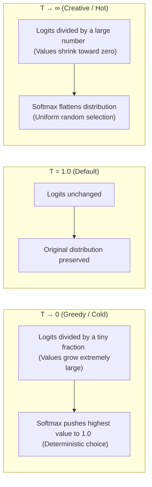
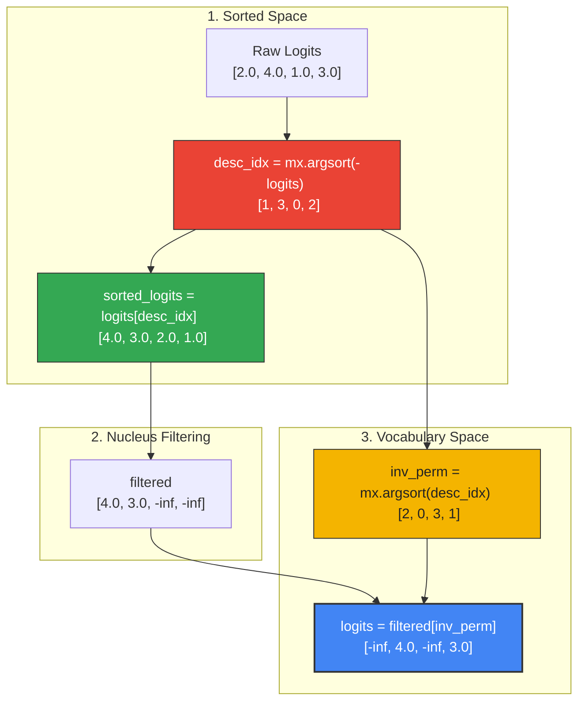

# Deep Dive: Probabilistic Sampling Strategies

This document provides a visual, mathematical, and structural walkthrough of **Probabilistic Sampling Strategies** in `tiny-duo-infer`. 

While neural layers (attention, FFNs) output raw numbers called **logits**, it is the sampling stage (`sampling.py`) that decides how these logits are turned into actual words. Understanding how the sampler shapes, filters, and draws from these distributions is the final piece of the LLM inference puzzle.

---

## 1. Why Sample? The Intuition

At the final step of a model forward pass, the model projects its hidden states to the vocabulary size, yielding a raw vector of **logits**:
$$z \in \mathbb{R}^{V}, \quad \text{where } V = 128,256 \text{ (vocabulary size)}$$

Logits represent unnormalized log-probabilities. If we simply select the token index with the highest logit on every step (called **greedy decoding** or **argmax**):
$$t = \text{argmax}(z)$$

The output is completely deterministic. While greedy decoding works well for structured tasks (like writing code or math), it often leads to boring, repetitive, or "looped" sentences in open-ended text generation.

**Probabilistic sampling** introduces variety by treating the model's logits as a probability distribution and drawing tokens randomly based on that distribution. To ensure the output remains coherent, we apply a 5-step pipeline to shape, prune, and sample from this distribution:

```text
  Raw Logits (V,)
       │
       ▼
 1. Temperature Scaling  ───► Controls overall entropy/creativity
       │
       ▼
 2. Top-k Partitioning   ───► Crops out the long tail of low-quality tokens
       │
       ▼
 3. Top-p (Nucleus)      ───► Dynamically shapes the pool based on confidence
       │
       ▼
 4. Softmax Norm         ───► Converts logits to actual probabilities (Sum = 1.0)
       │
       ▼
 5. Categorical Draw     ───► Selects one Token ID based on probabilities
```

---

## 2. Deep Dive: Temperature Scaling

Temperature scaling alters the "sharpness" of the probability distribution. It divides the entire logit vector by a positive scalar $T$ before the softmax normalization:

$$z'_i = \frac{z_i}{\max(T, 10^{-6})}$$



### Numerical Stability and Boundary Conditions
* **Why division by zero is avoided:** If $T = 0$, dividing $z_i / 0$ would result in `NaN` or `Infinity` errors.
* **The direct bypass:** In our code, we explicitly intercept `temperature == 0.0` at the very beginning and route it directly to our optimized `greedy` argmax function, avoiding division entirely:
  ```python
  if temperature == 0.0:
      return greedy(logits)
  ```

---

## 3. Deep Dive: Top-k Partitioning

Top-k filtering removes the "long tail" of highly unlikely tokens. By clipping the selection pool to only the $k$ most probable tokens, we prevent the model from accidentally drawing a completely unrelated word.

To do this efficiently in vector space, we calculate the logit value threshold of the $k$-th largest element:
$$\text{threshold} = \text{Sort}(z)[-k]$$

Because `mx.sort` sorts elements in ascending order, indexing at `[-k]` gives us the boundary value. We then use a parallel vector conditional mask (`mx.where`) to set all elements below this threshold to $-\infty$:

$$z^{\text{top-k}}_i = \begin{cases} z_i & \text{if } z_i \ge \text{threshold} \\ -\infty & \text{otherwise} \end{cases}$$

```python
# From tiny_duo_infer/sampling.py
threshold = mx.sort(logits)[-k]
neg_inf = mx.full(logits.shape, float("-inf"), dtype=logits.dtype)
logits = mx.where(logits >= threshold, logits, neg_inf)
```

Setting pruned logits to $-\infty$ is mathematically vital: when the vector is passed to the softmax function, $e^{-\infty} = 0$, meaning these pruned tokens receive exactly a $0\%$ probability of being drawn.

---

## 4. Deep Dive: Top-p (Nucleus) Filtering

While Top-k uses a **fixed quantity** of tokens, Top-p (Nucleus) uses a **variable quantity** based on the model's confidence. It selects the smallest pool of tokens whose cumulative probability sum reaches or exceeds a threshold $p$ (e.g., $0.90$).

* If the model is highly confident, the nucleus pool might contain only $1$ or $2$ tokens.
* If the model is highly uncertain, the nucleus pool expands dynamically to include dozens of tokens.

### The Boundary-Inclusive Math
A common logical bug in nucleus sampling is accidentally excluding the token that crosses the $p$ threshold, which can result in an empty pool if $p$ is small. 

To ensure we **include** the crossing token, we use a clever cumulative probability subtraction:
$$\text{keep}_i \iff \text{cumsum}(p)_i - p_i < \text{top\_p}$$

By subtracting the individual token's probability $p_i$ from its cumulative sum $\text{cumsum}(p)_i$, we check if the cumulative sum *strictly before* token $i$ was already past $p$. 
* If it was already past $p$, we exclude token $i$.
* If it was *not* yet past $p$ (meaning token $i$ is the one that crosses the boundary), we keep it!

### The Sorted Scatter-Back Permutation
To perform a cumulative sum, we must first sort the logits in descending order. However, after filtering them in sorted space, we must put them back into their original vocabulary index order so that our categorical sampler maps the drawn index to the correct word ID.

We achieve this using an **inverse permutation** via double-argsort:



```python
# From tiny_duo_infer/sampling.py
desc_idx = mx.argsort(-logits)            # Sort descending indices
sorted_logits = logits[desc_idx]          # Tensors sorted descending
...
# Scatter back to original vocabulary order
inv_perm = mx.argsort(desc_idx)           # The double argsort inverse perm
logits = filtered[inv_perm]               # Re-mapped back to vocab space
```

---

## 5. Drawing the Token: Categorical Sampling

Once the logits have been scaled (Step 1) and pruned of unlikely tokens (Steps 2 and 3), we are ready to draw a token.

In standard textbooks, you convert logits to probabilities using the Softmax equation:
$$P(x_i) = \frac{e^{z_i}}{\sum_j e^{z_j}}$$
And then perform a multinomial draw.

### The MLX Optimization
In `tiny-duo-infer`, we delegate this final probability conversion and draw directly to a single optimized MLX function:
```python
token = mx.random.categorical(logits)
mx.eval(token)
return token.item()
```

* **`mx.random.categorical(logits)`:** This function implicitly computes the softmax over the logits and draws a single categorical index directly on the GPU accelerator. This avoids having to write explicit exponential division in Python, which is numerically unstable for large logits.
* **`mx.eval(token)`:** Because MLX is lazy, the categorical draw graph is only scheduled, not executed. We call `mx.eval(token)` to flush the execution graph so that when we call `.item()` on the next line, the CPU can read the resulting integer token ID directly without triggering an out-of-order GPU pipeline stall.
