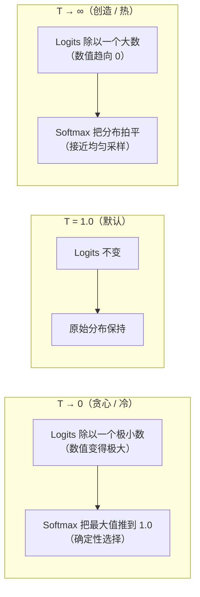
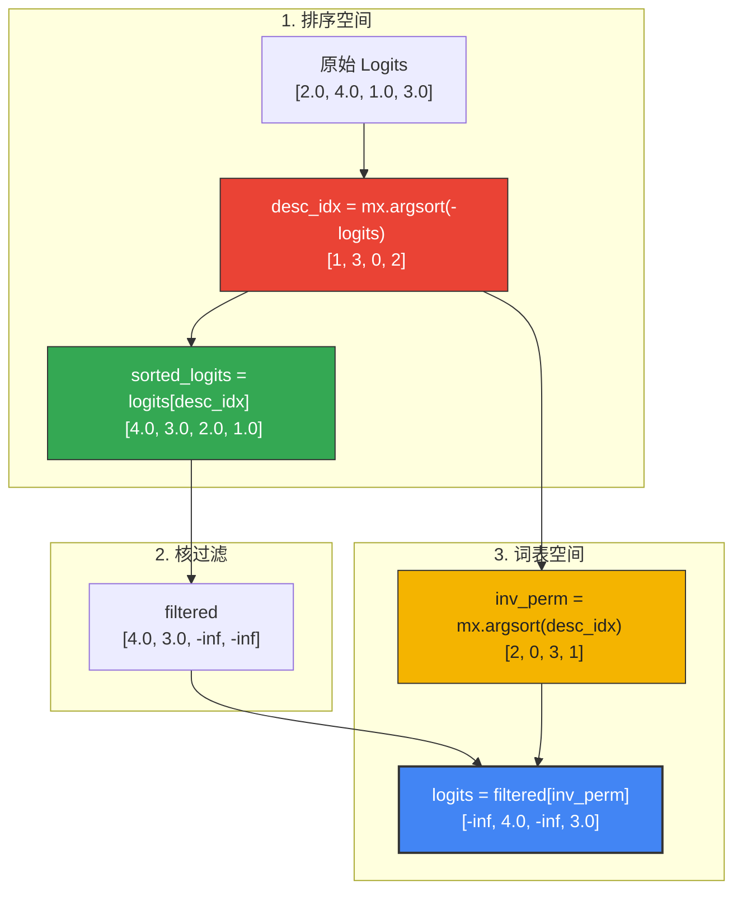

# 深入解析：概率采样策略

本文以可视化、数学化和结构化的角度，完整解读 `tiny-duo-infer` 中的**概率采样策略**。

神经层（attention、FFN）输出的只是一组叫做 **logits** 的原始数字，真正决定"这些数字如何变成具体词汇"的是采样阶段（`sampling.py`）。理解采样器如何对这些分布做塑形、过滤、最终抽取，是 LLM 推理这块拼图的最后一片。

---

## 1. 为什么要采样？直觉

模型前向传播的最后一步把隐状态投影到词表大小，得到一个 logits 向量：
$$z \in \mathbb{R}^{V}, \quad \text{其中 } V = 128{,}256 \text{（词表大小）}$$

logits 表示未归一化的对数概率。如果每一步都直接选取 logit 最大的索引（即 **贪心解码 / argmax**）：
$$t = \text{argmax}(z)$$

输出就是完全确定的。贪心解码在结构化任务（写代码、做数学）上表现不错，但对开放式文本生成往往会陷入呆板、重复、循环。

**概率采样**通过把 logits 当作一个概率分布、按其抽取 token 来引入多样性。为了让输出仍然连贯，整条流水线由 5 步对分布进行塑形、剪枝、抽样：

```text
  原始 Logits (V,)
       │
       ▼
 1. 温度缩放        ───► 控制分布的整体熵 / 创造性
       │
       ▼
 2. Top-k 切分      ───► 砍掉低质量长尾
       │
       ▼
 3. Top-p（核采样） ───► 根据置信度动态决定保留池
       │
       ▼
 4. Softmax 归一化  ───► 把 logits 变成实际概率（求和=1.0）
       │
       ▼
 5. 类别抽样        ───► 按概率抽取一个 token ID
```

---

## 2. 深入：温度缩放

温度缩放改变概率分布的"陡峭程度"：在 softmax 之前，把整段 logits 向量除以一个正标量 $T$：

$$z'_i = \frac{z_i}{\max(T, 10^{-6})}$$



### 数值稳定与边界条件
* **为什么避免除零：** 若 $T = 0$，$z_i / 0$ 会得到 `NaN` 或 `Infinity`。
* **直接旁路：** 代码在最开头显式拦截 `temperature == 0.0`，把它直接路由到优化过的 `greedy` argmax，避免任何除法：
  ```python
  if temperature == 0.0:
      return greedy(logits)
  ```

---

## 3. 深入：Top-k 切分

Top-k 过滤砍掉概率极低的"长尾" token。把可选池剪到只剩 $k$ 个最大概率的 token，能避免模型偶发选到完全不相关的词。

为了在向量空间里高效做这件事，我们计算第 $k$ 大元素的 logit 阈值：
$$\text{threshold} = \text{Sort}(z)[-k]$$

由于 `mx.sort` 升序排序，索引 `[-k]` 给出阈值。然后用并行向量条件掩码（`mx.where`）把所有低于阈值的元素置为 $-\infty$：

$$z^{\text{top-k}}_i = \begin{cases} z_i & \text{if } z_i \ge \text{threshold} \\ -\infty & \text{otherwise} \end{cases}$$

```python
# 摘自 tiny_duo_infer/sampling.py
threshold = mx.sort(logits)[-k]
neg_inf = mx.full(logits.shape, float("-inf"), dtype=logits.dtype)
logits = mx.where(logits >= threshold, logits, neg_inf)
```

把被剪除的 logits 置为 $-\infty$ 数学上至关重要：在 softmax 中 $e^{-\infty} = 0$，意味着这些 token 拿到精确的 $0\%$ 概率，不会被抽到。

---

## 4. 深入：Top-p（核采样）

Top-k 取**固定数量**的 token；Top-p（Nucleus）则按模型自身置信度取**变长的池**。它选取累积概率之和首次达到或超过阈值 $p$（例如 $0.90$）的最小 token 集合。

* 模型置信很高时，核池可能只有 $1$ 或 $2$ 个 token。
* 模型不确定时，核池会动态扩到几十个 token。

### 边界包含的数学
核采样里一个常见的逻辑 bug 是不小心把"刚刚跨过 $p$ 阈值"的那个 token 排除掉，从而在 $p$ 较小时得到空池。

为了**包含**这个跨阈值 token，我们使用一个巧妙的累积概率减法：
$$\text{keep}_i \iff \text{cumsum}(p)_i - p_i < \text{top\_p}$$

这里把 $p_i$ 从累积和中减掉，相当于检查"在 token $i$ 之前的累积概率是否已经超过 $p$"：
* 若**已**超过 $p$，排除 token $i$。
* 若**还没**超过 $p$（即 token $i$ 正是跨过阈值的那一个），保留它！

### 排序后的"散布回原序"置换
要做累积和，必须先把 logits 按降序排好。但在排序空间过滤完后，必须再放回原始词表索引顺序，以便类别采样器把抽中的索引映射到正确的词 ID。

我们用一个**逆置换**通过双重 argsort 实现：



```python
# 摘自 tiny_duo_infer/sampling.py
desc_idx = mx.argsort(-logits)            # 按降序得到索引
sorted_logits = logits[desc_idx]          # 按降序排列的张量
...
# 散布回原始词表顺序
inv_perm = mx.argsort(desc_idx)           # 双重 argsort 得到逆置换
logits = filtered[inv_perm]               # 还原回词表空间
```

---

## 5. 抽取 token：类别采样

经过缩放（步骤 1）和剪枝（步骤 2、3）后，logits 已准备好被抽样。

教科书上把 logits 转成概率用 Softmax：
$$P(x_i) = \frac{e^{z_i}}{\sum_j e^{z_j}}$$
然后做多项式抽取。

### MLX 优化
在 `tiny-duo-infer` 里，我们把这最后一步的概率转换与抽取交给一个 MLX 优化函数：
```python
token = mx.random.categorical(logits)
mx.eval(token)
return token.item()
```

* **`mx.random.categorical(logits)`：** 隐式对 logits 做 softmax，并直接在 GPU 上抽取一个类别索引。免去了 Python 端显式写 e 指数除法（对大 logits 数值不稳定）。
* **`mx.eval(token)`：** 由于 MLX 是 lazy 的，类别抽取的计算图只是被排程，并未执行。`mx.eval(token)` 会冲刷执行图，让下一行 `.item()` 能在 CPU 上直接读到结果整数 token ID，不会触发乱序的 GPU 流水线停顿。
