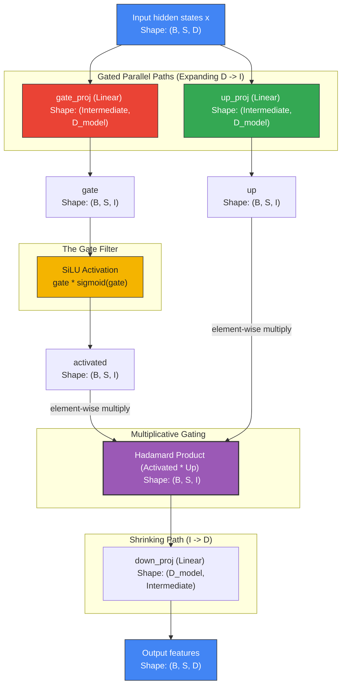

# Deep Dive: SwiGLU Feed-Forward Network (FFN)

This document provides a visual, mathematical, and structural walkthrough of the **SwiGLU Feed-Forward Network (FFN)** in `tiny-duo-infer`. 

In the Llama architecture, the standard Multi-Layer Perceptron (MLP) is replaced by a gated neural structure called SwiGLU. SwiGLU provides superior parameter efficiency and faster loss convergence than vanilla FFNs.

---

## 1. Mathematical Evolution: From ReLU to SwiGLU

### A. Standard Feed-Forward Network (Vanilla FFN)
In classical architectures like GPT-2 or BERT, a two-layer Feed-Forward Network is used. It projects the hidden states to a larger intermediate dimension, applies a non-linear activation function (like ReLU or GELU), and projects them back down:

$$\text{FFN}_{\text{ReLU}}(x) = \max(0, x W_1 + b_1) W_2 + b_2$$

Where:
* $W_1$: Projects $D \rightarrow I$ (Intermediate size).
* $W_2$: Projects $I \rightarrow D$.
* $\max(0, \cdot)$: The ReLU activation.

### B. Gated Linear Units (GLU)
Gated Linear Units (GLUs) introduce a multiplicative gate. Instead of a single projection path, the input $x$ is projected along **two parallel paths**: a value path and a gate path. The gate path goes through an activation function $\sigma$ (like Sigmoid) to filter or scale the value path:

$$\text{GLU}(x, W, V) = \sigma(x W) \otimes (x V)$$

Where $\otimes$ represents the element-wise multiplication (Hadamard product). The gating channel smoothly controls how much information flows through each intermediate dimension.

### C. The SwiGLU Formulation
The **SwiGLU** variant (introduced by Shazeer in 2020) replaces the Sigmoid activation with the **Swish** activation (also known as the **SiLU** or Sigmoid Linear Unit):

$$\text{SwiGLU}(x) = \left( \text{SiLU}(x W_{\text{gate}}) \otimes (x W_{\text{up}}) \right) W_{\text{down}}$$

Where:
* $W_{\text{gate}}$ (`gate_proj`): Activates the gate path.
* $W_{\text{up}}$ (`up_proj`): Projects the main value path.
* $W_{\text{down}}$ (`down_proj`): Projects the filtered states back to the base model size.

### SiLU Activation Function
The SiLU activation is a smooth, non-monotonic approximation of ReLU:

$$\text{SiLU}(z) = z \cdot \text{sigmoid}(z) = \frac{z}{1 + e^{-z}}$$

---

## 2. SwiGLU Information Flow in Llama-3.2-1B

For `Llama-3.2-1B`, the dimensions of the FFN layers are:
* Model Hidden Dimension ($D$): `d_model = 2048`
* Intermediate FFN Dimension ($I$): `intermediate_size = 8192`

This means the two expansion matrices (`gate_proj` and `up_proj`) expand the state from $2048 \rightarrow 8192$ (a $4\times$ expansion). `down_proj` shrinks it back from $8192 \rightarrow 2048$.

The flowchart below traces this gated parallel information flow:



---

## 3. Implementation Details & Custom SiLU Activation

Following our project constraints, we do not use high-level MLX layers like `mlx.nn.SiLU` or `mlx.nn.Linear`. Instead, the FFN is built from raw MLX math primitives:

### A. Independent Matrix Projections
The projections `gate_proj` and `up_proj` are completely independent and do not share any weight matrices:
```python
# From tiny_duo_infer/layers/feedforward.py
self.gate_proj = Linear(config.d_model, config.intermediate_size)
self.up_proj   = Linear(config.d_model, config.intermediate_size)
self.down_proj = Linear(config.intermediate_size, config.d_model)
```

### B. Custom SiLU Element-wise Math
The SiLU operation is written explicitly to show the mathematical sigmoid formula:
```python
# From tiny_duo_infer/layers/feedforward.py
gate = self.gate_proj(x)  # (B, S, I)
up   = self.up_proj(x)    # (B, S, I)

# Custom SiLU: gate * (1 / (1 + exp(-gate)))
activated = gate * (1.0 / (1.0 + mx.exp(-gate)))  # (B, S, I)
```

The element-wise multiplication `activated * up` performs the gating. If the activated gate value for a certain coordinate is close to $1.0$, the corresponding coordinate from `up` passes through unchanged. If it is close to $0.0$, the coordinate is blocked.

### C. Downward Projection
Finally, the gated features are projected back to the hidden dimension $D$:
```python
return self.down_proj(activated * up)  # (B, S, D)
```

---

## 4. Why SwiGLU Outperforms Classic FFNs

In standard FFNs (like GELU/ReLU FFNs), the non-linear activation acts as a simple hard threshold or monotonic scaling (either it passes, or it clips at 0). 

By contrast, SwiGLU's gating mechanism offers several key advantages:

1. **Dynamic Feature Selection:** The gating channel (`gate`) learns a specialized context-sensitive filter. The model can decide to pass certain features in `up` only when specific other features are present in `gate`.
2. **Smooth Gradient Flow:** The SiLU activation is continuously differentiable and smooth. Unlike ReLU (which has a sharp zero-gradient cutoff at $z < 0$), SiLU allows small negative gradients to flow back, preventing "dead neurons" during training and preserving subtle activations during inference.
3. **Capacity Allocation:** Expanding the channel width from $D \rightarrow I \rightarrow D$ using three projection matrices rather than two gives the model a much richer capacity to store and route factual knowledge.
