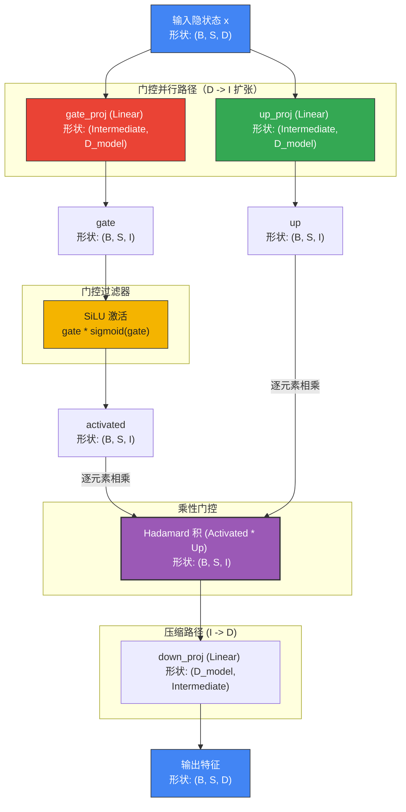

# 深入解析：SwiGLU 前馈网络（FFN）

本文以可视化、数学化和结构化的角度，完整解读 `tiny-duo-infer` 中的 **SwiGLU 前馈网络（Feed-Forward Network, FFN）**。

在 Llama 架构中，标准的多层感知机（MLP）被一种带门控的神经结构 SwiGLU 所替代。相比传统 FFN，SwiGLU 拥有更高的参数效率，并能更快收敛。

---

## 1. 数学演进：从 ReLU 到 SwiGLU

### A. 标准前馈网络（Vanilla FFN）
在 GPT-2、BERT 等经典架构中使用的是两层 FFN。它先把隐状态投影到一个更大的中间维度，再施加非线性激活（如 ReLU 或 GELU），最后投影回原维度：

$$\text{FFN}_{\text{ReLU}}(x) = \max(0, x W_1 + b_1) W_2 + b_2$$

其中：
* $W_1$：投影 $D \rightarrow I$（中间维度）。
* $W_2$：投影 $I \rightarrow D$。
* $\max(0, \cdot)$：ReLU 激活函数。

### B. 门控线性单元（GLU）
门控线性单元（Gated Linear Units, GLU）引入了**乘性门控**。输入 $x$ 不再走单一投影路径，而是沿**两条并行路径**投影：一条值路径，一条门控路径。门控路径经过激活函数 $\sigma$（例如 Sigmoid）后用于过滤、缩放值路径：

$$\text{GLU}(x, W, V) = \sigma(x W) \otimes (x V)$$

其中 $\otimes$ 表示逐元素相乘（Hadamard 积）。门控通道平滑地决定每个中间维度上能流过多少信息。

### C. SwiGLU 公式
**SwiGLU**（Shazeer 于 2020 年提出）把 GLU 中的 Sigmoid 激活替换成 **Swish**（也叫 **SiLU**，Sigmoid Linear Unit）：

$$\text{SwiGLU}(x) = \left( \text{SiLU}(x W_{\text{gate}}) \otimes (x W_{\text{up}}) \right) W_{\text{down}}$$

其中：
* $W_{\text{gate}}$（`gate_proj`）：激活门控路径。
* $W_{\text{up}}$（`up_proj`）：投影主值路径。
* $W_{\text{down}}$（`down_proj`）：把门控后的状态投影回基础模型维度。

### SiLU 激活函数
SiLU 是 ReLU 的一个平滑、非单调近似：

$$\text{SiLU}(z) = z \cdot \text{sigmoid}(z) = \frac{z}{1 + e^{-z}}$$

---

## 2. SwiGLU 在 Llama-3.2-1B 中的信息流动

`Llama-3.2-1B` 的 FFN 维度为：
* 隐状态维度（$D$）：`d_model = 2048`
* 中间维度（$I$）：`intermediate_size = 8192`

也就是说，`gate_proj` 与 `up_proj` 这两条扩张矩阵把状态从 $2048 \rightarrow 8192$（4 倍扩张），随后 `down_proj` 再压缩回 $8192 \rightarrow 2048$。

下面这张流程图勾勒了门控并行的信息流：



---

## 3. 实现细节与自定义 SiLU 激活

按本项目的设计约束，我们不使用 `mlx.nn.SiLU` 或 `mlx.nn.Linear` 这类高层 MLX 层，而是用裸 MLX 数学原语来搭建 FFN：

### A. 三个相互独立的矩阵投影
`gate_proj` 与 `up_proj` 完全独立，不共享任何权重矩阵：
```python
# 摘自 tiny_duo_infer/layers/feedforward.py
self.gate_proj = Linear(config.d_model, config.intermediate_size)
self.up_proj   = Linear(config.d_model, config.intermediate_size)
self.down_proj = Linear(config.intermediate_size, config.d_model)
```

### B. 自定义 SiLU 的逐元素数学
SiLU 操作显式写出 sigmoid 的数学表达，便于学习：
```python
# 摘自 tiny_duo_infer/layers/feedforward.py
gate = self.gate_proj(x)  # (B, S, I)
up   = self.up_proj(x)    # (B, S, I)

# 自定义 SiLU: gate * (1 / (1 + exp(-gate)))
activated = gate * (1.0 / (1.0 + mx.exp(-gate)))  # (B, S, I)
```

随后 `activated * up` 的逐元素相乘完成门控操作：若 activated 在某维度上接近 $1.0$，则 `up` 在该维度的值原样通过；若接近 $0.0$，则该维度被屏蔽。

### C. 下投影
最后把门控后的特征投影回隐状态维度 $D$：
```python
return self.down_proj(activated * up)  # (B, S, D)
```

---

## 4. 为什么 SwiGLU 优于经典 FFN

在标准 FFN（GELU/ReLU FFN）中，非线性激活只是一个硬阈值或单调缩放——要么放行，要么截断到 0。

SwiGLU 的门控机制提供了几项关键优势：

1. **动态特征选择：** 门控通道（`gate`）学到一种与上下文相关的滤波器。模型可以决定"只在 `gate` 中出现某些特征时，才允许 `up` 中对应的特征通过"。
2. **平滑的梯度流：** SiLU 是处处可导的平滑函数。不像 ReLU（在 $z < 0$ 处梯度被硬截断到 0），SiLU 让小幅负向梯度也能反向传播，避免训练时的"死神经元"，并在推理时保留细微激活值。
3. **容量分配：** 通道宽度按 $D \rightarrow I \rightarrow D$ 扩张并使用三个投影矩阵（而非两个），让模型有更丰富的能力去存储和路由事实性知识。
